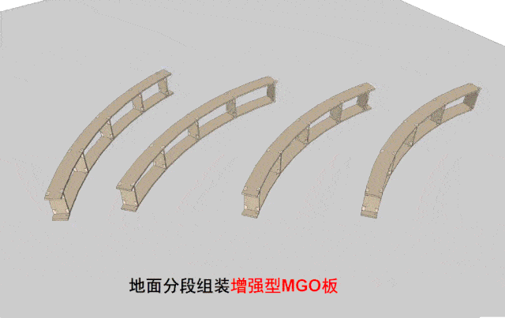
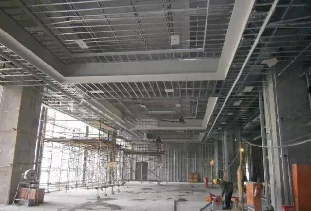
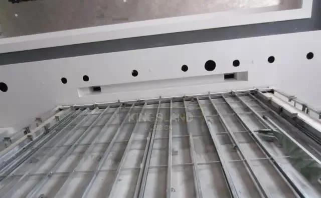

# 高端精装项目“全轻钢龙骨施工工艺标准”，能否靠技术/成本取代传统工艺？   
**在高端精装项目中，全轻钢龙施工标准做法已经很成熟，和传统工艺现场施工大量采用木龙骨基层、阻燃板基层、密度板基层、木工板基层等做法相比，准化、精细化、装配化、轻钢全龙骨施工标准和设计将更有利于项目成本管控、设计品质管控、施工周期管控，做出性价比高的文明工地。**   
    
但由于受长期传统观念影响，大多数的装修工人习惯采用木基层做法，一时无法转变观念，**习惯性以为采用“全轻钢龙骨”施工会慢，成本会增加，其实不然。**   
\*\*可工厂定制装配化运送到现场施工的“全轻钢龙骨”结构，能实现快速安装，大幅缩短安装时间，也就降低了人工成本，和材料成本综合来看，\*\*全轻钢龙骨标准并没有增加太多成本，反而提升了项目质量水平。   
    
下面我们就来介绍项目上常用的\*\*2种全龙骨施工工艺标准，\*\*文章建议收藏，同时我们提供了工艺电子版文件，会员可以免费下载（见文末）   
**01.**   
**“防火板材+轻钢龙骨”吊顶施工标准**   
\*\*防火板式轻钢龙骨基础结构工艺，是预制装配式轻钢龙骨石膏板吊顶施工工艺的核心工艺之一，\*\*吸取传统板式轻钢龙骨异型吊顶基础结构的优点，同样使用“板材”和“轻钢龙骨”结合制作异型吊顶基础结构的施工方法。   
吊顶结构工艺使用防火板材替代传统工艺使用的木质板材，选用的是环保的新型多组份不燃板材-增强型玻镁板（增强型MGO板）替代木质板材   
    
传统工艺 or 新连接件结构做法△   
    
直线吊顶灯槽安装工序△   
**第一阶段：吊顶设计深化**   
**1、吊顶施工图深化；**   
（1）按吊顶新工艺标准绘制吊顶深化设计图   
（2）提交异型吊顶防火板材、轻钢龙骨、石膏板及专用配件清单   
（3）提交异型吊顶异型M-GRG石膏预制件清单（4）提交平面吊顶轻钢龙骨、石膏板及配件清单   
职责：深化设计师实施、预算员配合   
    
传统工艺深化做法△   
    
新工艺深化做法△   
    
工厂化吊顶施工图深化△   
    
延边吊顶施工图深化△   
    
任意曲线灯槽吊顶施工图深化△   
**第二阶段：放线、备料**   
（1）现场放线；   
（2）异型M-GRG石膏预制件订货及预制加工，验收；   
（3）增强型MGO板、轻钢龙骨、石膏板及专用配件订货及预制加工   
    
    
**第三阶段：异型吊顶施工**   
（4）设置边界线龙骨，确认异型吊顶位置；   
（5）防火板（增强型MGO板）式异型吊顶基础结构（预设边界线结构）   
（6）异型M-GRG石膏预制件安装及验收；8、异型M-GRG石膏预制件连接、加固；   
（7）异型吊顶嵌缝、批灰、找平修整；   
注：预留和增加其他施工专业（水、电、风、暖、空调等）的施工空间和时间。   
    
    
**第四阶段：平面吊顶施工**   
（8）平面吊顶轻钢龙骨结构与异型吊顶边界线结构连接；   
（9）平面吊顶纸面石膏板与异型吊顶预留接口连接、安装；   
（10）全部吊顶表面嵌缝、批灰、找平修整，涂刷乳胶漆。   
职责：项目经理批准、施工员实施   
    
    
    
**案例：全龙骨圆弧造型施工工序展开**   
    
编龙骨造型结构△   
    
编龙骨造型结构△   
    
平顶封板△   
    
平顶封板，安装外圈石膏线△   
    
批灰休整，完成吊顶△   
    
**02.**   
**“免木防火轻钢龙骨”吊顶施工工艺**   
\*\*免木防火轻钢龙骨吊顶施工工艺，采用集成式卡式快速安装、\*\*节省人工节约材料、施工周期短结构稳定公差小（1mm）、防变形防开裂维修率极低；   
防火A级（GB 50222-2017）、防潮不变形、解决多级吊棚造型无木材、无木材环保、绿色材料无甲醛节能环保、且施工周期短；**可与工厂生产数据化、材料加工集中化、现场安装集成化**   
**1.无木天花装配式主要配件**   
    
**2.图纸及三维模型结构解析**   
    
    
全龙骨灯槽造型工艺（一）△   
    
    
全龙骨灯槽造型工艺（二）△   
    
    
全龙骨灯槽造型工艺（三）△   
    
    
全龙骨灯槽造型工艺（四）△   
    
    
全龙骨跌级灯槽造型工艺（五）△   
    
    
全龙骨延边灯槽造型工艺（五）△   
**3.全龙骨项目案例**   
    
    
    
深圳侨城项目现场△   
    
    
    
    
某高端酒店项目△   
**小编和你分享的全龙骨标准施工，虽然国内项目短时间很难转变使用标准化、精细化的全龙骨结构工艺，但这种高标准的工法希望广大装饰同行可以掌握，以应对更加复杂的项目综合管控需要。**   
